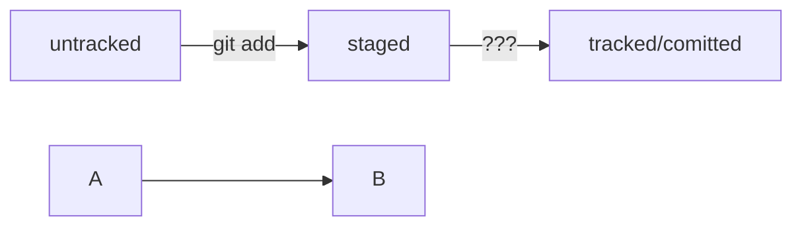

# git-cheat-sheet

## Installation

- [Download Git for all platfoms] (htp://git-scm.com)
or for specific platform 
- [For Mac] (htps://windows.github.com)
- [For Windows] (htps://windows.github.com)

## Setup 

1. Configure user information
```
git config --global user.name “[firstname lastname]”
git config --global user.email “[valid-email]”
```

2. Init repository 
New local repository:
```
git init
```
Or clone existing
```
git clone [url]
```

## Basic usage
Show repository status
```
git status
```
Add file 
```
git add file.extension
```
Commit file 
```
git commit -m "commit msg"
```
Push to remote repository
```
git push origin master
```

## Git log

Used to show commit history.

To show compact view of log use:
```
git log --oneline
```

## Commit messages

There are few commit-message styles.

Most popular are: Conventional Commits and GitHub-style

## Mermaid



## Commit edit

To add more files to last commit use:
```
git commit --amend --no-edit
```
**Don't use this command if commit is already pushed to remote!**

To edit commit message use:
```
git commit --amend -m "New message"
```
## Rollback
To unstage file use:
```
git restore --staged <file>

```
To rollback commit use:
```
git reset --hard <commit hash>
```
Commit hash here is the commit to which you would like to return.
This commit will become HEAD.
## Branches 
Create a new branch and then use it:
```
git branch %BRANCH_NAME%
git checkout %BRANCH_NAME%
```
Or in one line:
```
git checkout -b bugfix/fix-branch
```
To show all branches including remote use:
```
git branch -a

```